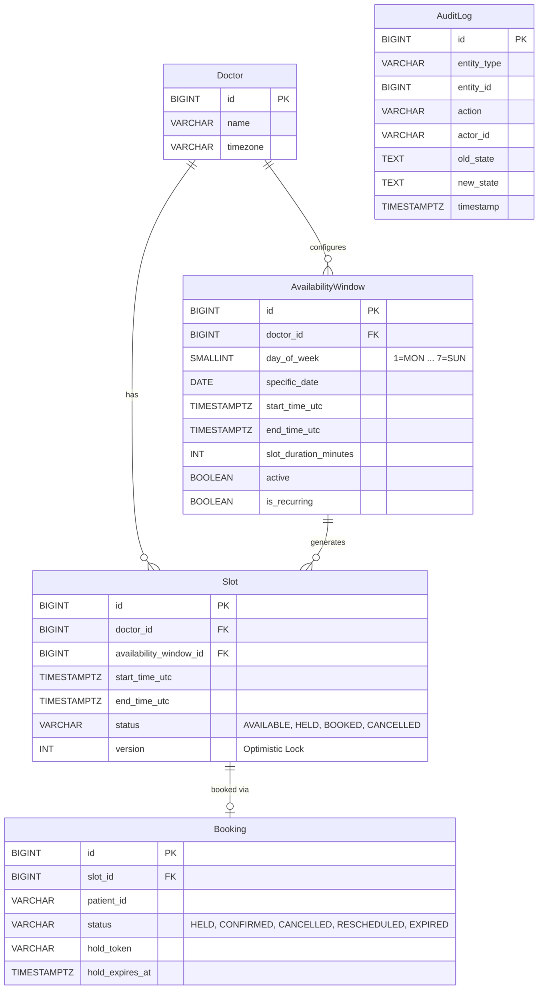

# Clinzo: Doctor Slot Scheduling System

Clinzo is a high-performance, concurrency-safe appointment scheduling system designed to handle real-world scenarios where multiple patients attempt to book the same doctor's slot simultaneously.

## 1. Approach

The foundational design choice of Clinzo is using **materialized slots** rather than computing availability on the fly from an availability window. When a doctor configures their hours, individual `Slot` entities are physically generated and stored in the database. This is essential for concurrency: you need a durable row in a database to hold a unique constraint and an optimistic lock version number against. Without materialized slots, preventing double-booking requires heavy table-level or range locks which devastate throughput.

The system supports **two booking paths**:
1. **Token-verified hold -> confirm**: A patient "holds" a slot while they fill out a form or complete payment. They receive an opaque token, and must present it within a TTL to confirm.
2. **Direct confirm**: A patient books the slot immediately without holding it first.
Both paths are necessary because while the hold path is critical for a smooth user experience (UX) during checkout, a direct confirm path is required for fast-path operations (like a clinic receptionist booking directly).

To make the UX fast and reliable, Clinzo uses **Redis as a fast-fail UX layer**. A Redis `SET NX` command acquires a hold in memory, instantly rejecting concurrent users attempting to hold the same slot. However, **Postgres remains the source of truth**. Even if Redis is out of sync, the database uses optimistic locking (`version` column) and single-query atomic state transitions to guarantee exactly-one-winner semantics.

## 2. Assumptions & Business Rules

During implementation, several business rules and defaults were established to handle edge cases not fully dictated by the initial specification:

*   **Timezone Defaulting**: For slot queries (`GET /doctors/{doctorId}/slots`), if the `tz` parameter is omitted, the system defaults to the doctor's configured timezone (`Doctor.timezone`).
*   **Hold TTL**: The Time-To-Live for a held slot is strictly **120 seconds**.
*   **Expiry Sweep Interval**: The `HoldExpiryScheduler` runs a background sweep every **30 seconds** (`@Scheduled(fixedRate = 30000)`).
*   **Availability Window Configurations**: When creating an availability window, exactly one of `day_of_week` (for recurring) or `specific_date` (for one-offs) must be set.
*   **Pruning Slots**: When a doctor updates their availability window to shrink their hours, any pre-existing slots that fall outside the new time bounds are **DELETED**, but *only* if their status is `AVAILABLE`. If a slot is `BOOKED` or `HELD`, it is preserved and a warning is logged so the doctor can manually cancel/reschedule.
*   **Reschedule Preconditions**: Only a `CONFIRMED` booking can be rescheduled. `HELD` or `CANCELLED` bookings cannot be rescheduled.
*   **Cancel Preconditions**: Both `CONFIRMED` and `HELD` bookings can be cancelled. `CANCELLED` or `RESCHEDULED` bookings cannot.

## 3. Data Model



## 4. Concurrency Strategy

Clinzo uses a dual-layer concurrency strategy: **Redis Distributed Locks (Fast-Fail)** + **PostgreSQL Optimistic Locking (Source of Truth)**.

We chose Optimistic Locking (versioning) over `SELECT FOR UPDATE` (pessimistic locking) because scheduling systems are extremely read-heavy. Pessimistic locks block readers and can lead to connection pool exhaustion during traffic spikes. Optimistic locking allows lock-free reads and relies on a `WHERE id = ? AND version = ?` atomic update. If two threads attempt to book, the database safely rejects one via a 0-row update, and the application translates this into a 409 Conflict.

Because there is a "dead zone" between the time a Redis hold TTL expires (120s) and when the background sweep runs (every 30s) to reset the slot to `AVAILABLE`, it's possible a patient attempts to confirm an expired hold right as the scheduler is trying to sweep it. The `HoldExpiryProcessor` handles this race condition by performing a 0-row check: if the scheduler attempts to sweep but affects 0 rows, it assumes a concurrent user successfully completed their booking and gracefully exits (no-op) without throwing an exception or writing a false audit log.

These concurrency mechanisms are mathematically proven by Testcontainers-backed multi-threaded integration tests:

*   **hold-race**: `BookingServiceConcurrencyTest.highContention_50Threads_concurrentHold_exactlyOneWinner`
*   **confirm-race**: `BookingServiceConcurrencyTest.highContention_50Threads_directBooking_exactlyOneWinner`
*   **mixed hold-vs-direct-confirm race**: `BookingServiceConcurrencyTest.highContention_50Threads_mixedPath_25Hold_25DirectConfirm_exactlyOneWinner`
*   **reschedule-collision race**: `BookingServiceConcurrencyTest.highContention_2Patients_concurrentReschedule_toSameSlot_exactlyOneWinner`
*   **double-cancel race**: `BookingServiceConcurrencyTest.concurrentDoubleCancel_onSameBooking_exactlyOneWinner`
*   **availability-prune-vs-confirm race**: `BookingServiceConcurrencyTest.concurrentWindowUpdate_and_confirmBooking`
*   **expiry-sweep-vs-confirm race**: `HoldExpirySchedulerTest.sweepVsConfirmRace`

## 5. API Reference

The following endpoints were fully built, implemented, and tested in the Controller layer during Phases 3-7:

| Method | Path | Request Body | Response | Status Codes |
| :--- | :--- | :--- | :--- | :--- |
| **GET** | `/doctors/{doctorId}/slots` | Query Params: <br/> `date` (required, e.g. 2026-08-01)<br/> `tz` (optional, defaults to doctor's tz)<br/> `type` (optional, e.g. GENERAL) | `List<SlotResponseDTO>` | 200 OK<br/>400 Bad Request (invalid tz/date) |
| **PUT** | `/doctors/{doctorId}/availability/{windowId}` | `UpdateAvailabilityWindowRequestDTO` (Optional overrides for dayOfWeek, startTime, etc) | `UpdateAvailabilityWindowResponseDTO` | 200 OK<br/>404 Not Found<br/>400 Bad Request |
| **DELETE** | `/doctors/{doctorId}/availability/{windowId}`| *None* | `UpdateAvailabilityWindowResponseDTO` (marks active=false) | 200 OK<br/>404 Not Found |
| **POST** | `/slots/{id}/hold` | `HoldRequestDTO`<br/>`{ "patientId": "p1" }` | `HoldResponseDTO` | 200 OK<br/>404 Not Found<br/>409 Conflict |
| **POST** | `/bookings` | `BookingRequestDTO`<br/>`{ "slotId": 123, "patientId": "p1", "holdToken": "..." }` | `BookingResponseDTO` | 201 Created<br/>404 Not Found<br/>409 Conflict |
| **DELETE** | `/bookings/{id}` | *None* | `BookingResponseDTO` (status=CANCELLED) | 200 OK<br/>404 Not Found<br/>409 Conflict |
| **PATCH** | `/bookings/{id}/reschedule` | `RescheduleRequestDTO` <br/>`{ "newSlotId": 123 }` | `BookingResponseDTO` (status=CONFIRMED) | 200 OK<br/>404 Not Found<br/>409 Conflict |

## 6. Setup Instructions

To run the application and verify the concurrency tests on your local machine:

1. **Clone the repository** (or navigate to the workspace).
2. **Start Infrastructure**: Spin up Postgres and Redis.
   ```bash
   docker-compose up -d
   ```
3. **Run the Test Suite**: The tests will use Testcontainers (which requires Docker running locally) to spin up ephemeral Postgres/Redis nodes, execute 50-thread races, and verify exactly-one-winner semantics.
   ```bash
   ./mvnw clean test
   ```
4. **Run the Application**: 
   ```bash
   ./mvnw spring-boot:run
   ```

## 7. Trade-Offs & What I'd Do Differently At Scale

*   **Database Sharding & Hot Doctors**: Under extreme load (e.g., a famous doctor releasing slots), the system will experience high contention on specific rows. At scale, I would shard the database by `doctor_id` so that contention for one doctor doesn't degrade database performance for another.
*   **Hold Expiry Scheduler at Scale**: Currently, `@Scheduled(fixedRate = 30000)` runs the sweep on the JVM. If we deploy 10 instances of the Clinzo API, 10 sweeps will run simultaneously. At scale, this must be moved to a distributed, leader-elected job (like Quartz, or ShedLock) so only one worker performs the sweep.
*   **Booking History vs. Mutable Rows**: We currently mutate the `status` column of the `Booking` and `Slot` rows. While we added a centralized `AuditLog`, a true event-sourced architecture (where bookings are immutable ledgers of events) would provide even stronger guarantees and easier rollbacks.
## 8. Bonus Work Checklist

The following items were explicitly **NOT ATTEMPTED** per the original scoping decisions:
- [ ] Variable-length appointment types (e.g., 30m vs 60m dynamic slots).
- [ ] Waitlist functionality for fully-booked slots.
- [ ] Multi-doctor booking (e.g., booking an appointment with "any available physician").

---

### Final Test Suite Verification

```
[INFO] -------------------------------------------------------
[INFO]  T E S T S
[INFO] -------------------------------------------------------
[INFO] Running com.clinzo.service.HoldServiceTest
[INFO] Tests run: 3, Failures: 0, Errors: 0, Skipped: 0, Time elapsed: 3.324 s -- in com.clinzo.service.HoldServiceTest
[INFO] Running com.clinzo.service.SlotGenerationServiceTest
[INFO] Tests run: 4, Failures: 0, Errors: 0, Skipped: 0, Time elapsed: 1.157 s -- in com.clinzo.service.SlotGenerationServiceTest
[INFO] Running com.clinzo.service.BookingServiceConcurrencyTest
[INFO] Tests run: 14, Failures: 0, Errors: 0, Skipped: 0, Time elapsed: 8.653 s -- in com.clinzo.service.BookingServiceConcurrencyTest
[INFO] Running com.clinzo.controller.BookingControllerTest
[INFO] Tests run: 6, Failures: 0, Errors: 0, Skipped: 0, Time elapsed: 1.096 s -- in com.clinzo.controller.BookingControllerTest
[INFO] Running com.clinzo.controller.SlotControllerTest
[INFO] Tests run: 2, Failures: 0, Errors: 0, Skipped: 0, Time elapsed: 1.096 s -- in com.clinzo.controller.SlotControllerTest
[INFO] Running com.clinzo.service.HoldExpirySchedulerTest
[INFO] Tests run: 3, Failures: 0, Errors: 0, Skipped: 0, Time elapsed: 0.902 s -- in com.clinzo.service.HoldExpirySchedulerTest
[INFO] Running com.clinzo.service.AvailabilityServiceTest
[INFO] Tests run: 12, Failures: 0, Errors: 0, Skipped: 0, Time elapsed: 1.637 s -- in com.clinzo.service.AvailabilityServiceTest
[INFO] Running com.clinzo.controller.DoctorControllerTest
[INFO] Tests run: 3, Failures: 0, Errors: 0, Skipped: 0, Time elapsed: 0.362 s -- in com.clinzo.controller.DoctorControllerTest
[INFO] Running com.clinzo.service.SlotQueryServiceTest
[INFO] Tests run: 4, Failures: 0, Errors: 0, Skipped: 0, Time elapsed: 0.362 s -- in com.clinzo.service.SlotQueryServiceTest
[INFO] Running com.clinzo.validation.AvailabilityWindowValidatorTest
[INFO] Tests run: 6, Failures: 0, Errors: 0, Skipped: 0, Time elapsed: 0.206 s -- in com.clinzo.validation.AvailabilityWindowValidatorTest
[INFO] 
[INFO] Results:
[INFO] 
[INFO] Tests run: 54, Failures: 0, Errors: 0, Skipped: 0
[INFO] 
[INFO] ------------------------------------------------------------------------
[INFO] BUILD SUCCESS
[INFO] ------------------------------------------------------------------------
```
